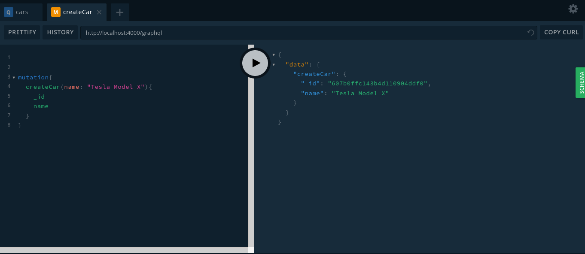
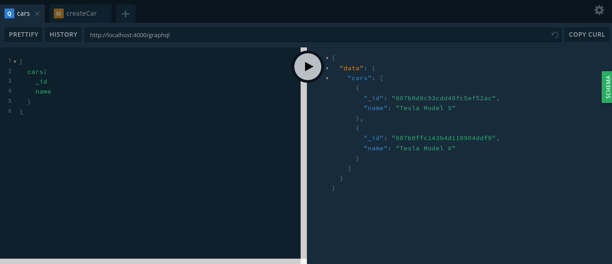

# GRAPHQL QUERYS AND MUTATIONS :rocket:

This is a graphql _practice_.  
Learning to do basic querys and mutations.

## Technologies used for this project :computer:

-  [graphql](https://graphql.org/)
-  [apollo server](https://www.npmjs.com/package/apollo-server-express)
-  [nodejs](https://nodejs.org/en/)

## Screenshots :camera:




## Hacking

```cmd
git clone https://github.com/gabrielba15/
cd
npm install
npm run dev
```

> Ready, happy hacking :D
